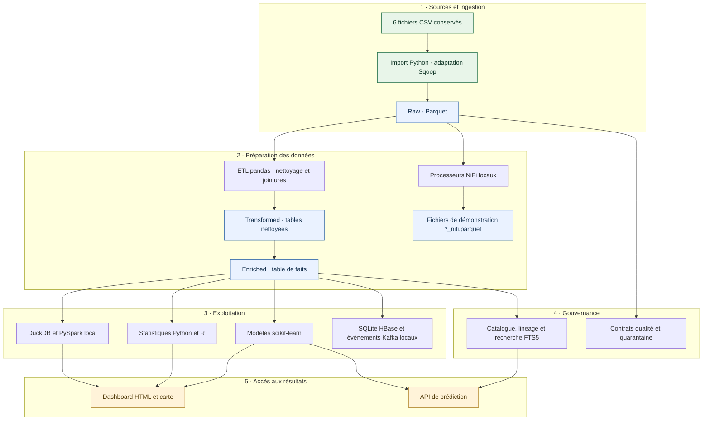
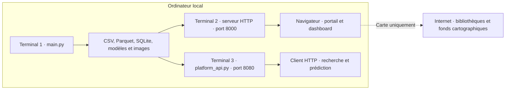

# Semences R&D

**Plateforme d’analyse des essais agronomiques · Projet de groupe**


<p align="center">
  <a href="#1-démarrage-rapide">Démarrer</a> ·
  <a href="#3-fonctionnement-et-architecture">Comprendre l’architecture</a> ·
  <a href="#7-utiliser-lapi">Utiliser l’API</a> ·
  <a href="deliverables/presentation_semences.pptx">Télécharger la présentation</a>
</p>

Projet réalisé en groupe. Le dépôt contient le code, les six jeux de données sources, les résultats de démonstration, les dashboards existants et une présentation d’architecture détaillée.

Le projet transforme des fichiers CSV d’essais semenciers en données exploitables : table de faits, statistiques, carte, catalogue de recherche et modèles de rendement. Il s’agit d’un **prototype local fonctionnel**, avec des adaptations pédagogiques des composants Big Data. Aucun cluster Hadoop, serveur Kafka, NiFi ou HBase n’est nécessaire pour l’exécuter.

| Données | Traitement | Résultats | Documentation |
|---|---|---|---|
| 6 fichiers CSV | 17 phases orchestrées | Dashboard, carte et API | Guide complet et PPTX de 26 slides |
| 136 358 mesures | Python, SQL, Spark et R | Statistiques et modèles ML | Architecture, installation et dépannage |

### Choisir son parcours

| Je veux… | Ce qu’il faut installer | Où commencer |
|---|---|---|
| **Voir le projet fonctionner** | Python ; les résultats sont déjà fournis | [Démonstration locale](#consulter-les-résultats-déjà-fournis) |
| **Recalculer les données et modèles** | Python 3.12, dépendances, R ; Java pour PySpark | [Installation complète](#2-installation-complète) |
| **Interroger le catalogue ou prédire** | Environnement Python installé et artefacts fournis ou recalculés | [API locale](#7-utiliser-lapi) |
| **Comprendre les choix techniques** | Aucun logiciel supplémentaire pour lire ce README | [Architecture](#3-fonctionnement-et-architecture) |

> **Sur GitHub, ce fichier présente le projet.** Les liens `127.0.0.1` ouvrent le serveur de votre propre ordinateur : ils fonctionnent après avoir téléchargé le dépôt et lancé la commande indiquée ci-dessous. GitHub n’exécute pas le pipeline à la lecture du README.

## Sommaire

1. [Démarrage rapide](#1-démarrage-rapide)
2. [Installation complète](#2-installation-complète)
3. [Fonctionnement et architecture](#3-fonctionnement-et-architecture)
4. [Données et modèle](#4-données-et-modèle)
5. [Les 17 phases](#5-les-17-phases)
6. [Utiliser les dashboards](#6-utiliser-les-dashboards)
7. [Utiliser l’API](#7-utiliser-lapi)
8. [Comprendre les modèles](#8-comprendre-les-modèles)
9. [Qualité, catalogue et traçabilité](#9-qualité-catalogue-et-traçabilité)
10. [Vérifications et dépannage](#10-vérifications-et-dépannage)
11. [Structure du dépôt](#11-structure-du-dépôt)
12. [Contribuer et préparer la remise](#12-contribuer-et-préparer-la-remise)

## 1. Démarrage rapide

### Récupérer le projet depuis GitHub

1. Sur la page du dépôt, cliquer sur **Code → Download ZIP**, ou cloner l’adresse proposée par **Code → HTTPS**.
2. Extraire **toute l’archive** dans un dossier local. Ne pas lancer le projet depuis l’intérieur du ZIP.
3. Ouvrir un terminal dans le dossier qui contient `main.py`, `requirements.txt`, `INDEX.html` et `CSV/`. Le nom de ce dossier peut varier selon le téléchargement.

Les commandes suivantes partent de ce dossier. Télécharger uniquement le README ou `main.py` ne suffit pas : les pages utilisent les données, scripts et images du dépôt.

### Consulter les résultats déjà fournis

**Windows / PowerShell**, depuis la racine :

```powershell
py -3.12 tools/check_environment.py --demo
py -3.12 -m http.server 8000 --bind 127.0.0.1
```

**Linux / macOS** :

```bash
python3 tools/check_environment.py --demo
python3 -m http.server 8000 --bind 127.0.0.1
```

Si Windows ne reconnaît pas `py` mais que `python --version` fonctionne, utiliser `python` à sa place. Pour ce parcours de consultation, les bibliothèques d’analyse, R et Java ne sont pas nécessaires.

Puis ouvrir :

- Portail : http://127.0.0.1:8000/INDEX.html
- Dashboard : http://127.0.0.1:8000/reports/dashboard.html
- Carte : http://127.0.0.1:8000/reports/carte_essais.html
- Présentation : [presentation_semences.pptx](deliverables/presentation_semences.pptx)

**Utiliser le serveur HTTP**, même pour une démonstration locale : les tableaux du dashboard chargent leurs CSV avec `fetch`. Un double-clic sur le fichier HTML ne suffit pas toujours. Les tableaux et graphiques utilisent les fichiers locaux ; la carte nécessite Internet pour Leaflet et les fonds cartographiques. Arrêter le serveur avec `Ctrl+C`.

**Résultat attendu de la consultation :** le portail s’affiche, le dashboard charge ses tableaux et une recherche sur « Soja » filtre les lignes. Garder le terminal ouvert pendant la consultation. Si le port 8000 est occupé, utiliser 8001 dans la commande **et** dans l’adresse du navigateur.

### Recalculer les résultats

Après l’installation décrite ci-dessous :

```powershell
.\.venv\Scripts\python.exe -X utf8 main.py
.\.venv\Scripts\python.exe -m unittest discover -s tests -v
```

Le pipeline s’arrête au premier échec et retourne un code de sortie non nul. Une exécution complète doit terminer avec **17 phases réussies sur 17**. La durée dépend du matériel et du moteur Spark disponible ; les anciens temps affichés ne constituent pas un engagement de performance.

## 2. Installation complète

### Prérequis

Installer Python, R et Java avant de lancer le pipeline complet. La première installation des dépendances nécessite Internet. Les instructions de ce dépôt ont été vérifiées sous Windows avec Python 3.12 ; les commandes Linux/macOS sont fournies, mais ces systèmes n’ont pas fait l’objet de la même validation ici.

| Composant | Utilisation |
|---|---|
| Python 3.12 | Version utilisée pour la vérification du dépôt |
| `pip` et un environnement virtuel | Installation isolée des dépendances |
| R, version 4.3 ou supérieure | Obligatoire pour la phase 14 ; le script automatisé utilise les bibliothèques de base |
| Java compatible avec PySpark 3.5.5 | Nécessaire pour exécuter réellement Spark ; Java 11 est présent dans l’environnement de vérification |
| Navigateur récent | Dashboard et carte |
| PowerPoint ou lecteur PPTX compatible | Lecture de la présentation fournie |

Les versions Python sont fixées dans [requirements.txt](requirements.txt). Le PPTX est fourni comme livrable maintenu : Node.js et les outils de création de slides ne sont pas nécessaires pour lancer le projet.

`setuptools` est inclus pour fournir la compatibilité `distutils` attendue par PySpark 3.5.5 sous Python 3.12.

### Windows / PowerShell

**Terminal 1 — installer, vérifier, puis calculer :**

```powershell
# Se placer dans le dossier contenant main.py et CSV/
py -3.12 -m venv .venv
.\.venv\Scripts\python.exe -m pip install -r requirements.txt
.\.venv\Scripts\python.exe -m pip check
.\.venv\Scripts\python.exe -X utf8 tools/check_environment.py --strict-spark
.\.venv\Scripts\python.exe -X utf8 main.py
.\.venv\Scripts\python.exe -m unittest discover -s tests -v
```

L’appel direct à `.venv\Scripts\python.exe` évite de modifier la politique d’exécution PowerShell pour activer l’environnement.

Installer R au préalable. Le programme recherche `Rscript` dans le `PATH`, puis dans `C:\Program Files\R\...\bin\Rscript.exe`. Si R est installé ailleurs, ajouter son dossier `bin` au `PATH` du terminal. Vérifier Java avec `java -version` et Python avec `python --version`.

Sous Windows, ouvrir ensuite un deuxième terminal depuis la racine pour servir les résultats :

```powershell
.\.venv\Scripts\python.exe -m http.server 8000 --bind 127.0.0.1
```

Ouvrir http://127.0.0.1:8000/INDEX.html. L’API utilise un troisième terminal, décrit dans la [section API](#7-utiliser-lapi).

### Linux / macOS

```bash
python3.12 -m venv .venv
source .venv/bin/activate
python -m pip install -r requirements.txt
python -m pip check
Rscript --version
java -version
python tools/check_environment.py --strict-spark
python -X utf8 main.py
python -m unittest discover -s tests -v
```

Dans un autre terminal, depuis la même racine : `python3 -m http.server 8000 --bind 127.0.0.1`.

Rscript et Java doivent être accessibles dans le `PATH`. Si Spark ne démarre pas, la phase 8 utilise pandas et l’indique dans `reports/spark_report.json`. Cela permet une démonstration locale, mais ne valide pas une exécution Spark. L’absence de R est bloquante : cette étape ne dispose pas de remplacement Python silencieux.

### Comprendre le diagnostic

Le diagnostic `tools/check_environment.py` ne télécharge rien et ne modifie pas les données. Il vérifie les fichiers nécessaires, les sources, les versions des packages, Rscript et Java. `OK` indique un prérequis détecté, `ATTENTION` une différence de version ou un composant optionnel absent, et `MANQUANT` un élément bloquant à corriger. Le mode `--demo` vérifie uniquement la consultation ; `--strict-spark` rend Java obligatoire.

Ce diagnostic ne remplace pas l’exécution : vérifier ensuite que `reports/spark_report.json` indique `"engine": "PySpark"` si une véritable exécution Spark est attendue.

### Reprendre après une erreur

```powershell
.\.venv\Scripts\python.exe -X utf8 main.py --resume
```

`--resume` ignore les étapes marquées `OK` dans `reports/pipeline_checkpoint.json`. Il ne vérifie pas que leurs fichiers sont encore présents ni que les CSV ont changé. Après une modification des sources, du code de transformation ou la suppression de résultats, relancer **sans `--resume`**. Ne pas lancer deux pipelines simultanément sur le même dossier.

## 3. Fonctionnement et architecture

### Vue des traitements

Le schéma présente les composants réellement présents dans le code. Chaque couche possède des fichiers de sortie identifiables ; les services d’une future infrastructure distribuée sont décrits séparément dans la documentation d’architecture.



Les zones séparent les données originales, les transformations et les usages. L’ETL principal relit les Parquet `data/raw/` ; les fichiers `*_nifi.parquet` illustrent le flux NiFi et ne sont pas ses entrées effectives. Les traitements sont exécutés séquentiellement par `main.py`.

Les flèches représentent les dépendances de données. L’ordre exact d’exécution est celui des [17 phases](#5-les-17-phases). La quarantaine constitue actuellement un audit en fin de chaîne : elle ne filtre pas automatiquement toutes les données utilisées en amont.

### Vue du lancement sur un ordinateur



Le pipeline est une commande qui se termine. Le serveur des pages et l’API restent actifs tant que leurs terminaux sont ouverts. Le dashboard consulte des fichiers locaux : l’API est un service complémentaire, elle n’est pas nécessaire pour afficher les tableaux.

### Correspondance entre concepts et code

| Concept d’architecture | Implémentation dans ce dépôt | Limite |
|---|---|---|
| HDFS / Data Lake | Répertoires et fichiers Parquet | Stockage local, sans réplication |
| Sqoop | Lecture CSV et écriture Parquet avec pandas | Pas d’import JDBC réel |
| NiFi | Classes de processeurs Python, routage et provenance | Pas de serveur ni de flow NiFi déployé |
| Talend ETL | Fonctions pandas | Pas de job Talend exporté |
| HBase | Tables SQLite organisées par familles logiques | Pas de cluster HBase |
| Kafka | Producteurs, consommateurs et files en mémoire | Pas de broker persistant |
| Hive et Drill | Requêtes adaptées et exécutées par DuckDB | Ports affichés uniquement illustratifs |
| Spark | PySpark en mode `local[*]`, processus séparé | Repli pandas consigné si nécessaire |
| Catalogue / recherche | SQLite, métadonnées, lineage et FTS5 | Pas d’Atlas ni d’OpenSearch déployé |
| Analyse et ML | Python, Rscript, scikit-learn | Validation expérimentale, usage local |
| Restitution | HTML, JavaScript, images et carte Leaflet | Pas de plateforme BI d’entreprise |

Les choix et l’architecture cible sont détaillés dans [docs/ARCHITECTURE_CHOICES.md](docs/ARCHITECTURE_CHOICES.md). Les composants proposés pour la production sont des évolutions, pas des services fournis avec le dépôt.

## 4. Données et modèle

### Sources à conserver

Tous les CSV sont dans `CSV/`, avec un séparateur `;`. L’ingestion conserve ces fichiers et produit des Parquet séparés.

| Fichier | Contenu | Identifiant principal |
|---|---|---|
| `ESSAI.csv` | Essais, campagne, localisation et fiabilité | `LK_EXPERIMENT_EXPERIMENT_ID` |
| `RESULTAT_ESSAIS.csv` | Mesures, traits, entrées et réplications | `LK_SL_TRIAL_L2_DATA_ID` |
| `PARCELLE_SPECIFICATION_20190108.csv` | Association parcelle / essai / matériel | `LK_SL_TRIAL_L4_DATA_ID` |
| `LK_CRISP_MATERIAL_20190108.csv` | Matériels, noms et pedigrees | `LK_STOCK_S1_DATA_ID` |
| `REF_ESPECES_20190108.csv` | Référentiel d’espèces | `SPECIES_ID`, `SPECIES_SPECIFICITY_ID` |
| `TRIAL_QUALIFICATION_20190108.csv` | Qualifications d’essais | `SL_TRIAL`, `YEAR`, `QUALIFICATION` |

### Construction de la table de faits

Une ligne représente une mesure d’un trait pour une entrée et une réplication d’essai. Le pipeline normalise les identifiants, les années et les nombres à virgule, puis enrichit les résultats avec les essais, les parcelles, les matériels et les qualifications pivotées. Les jointures gauches conservent les mesures dont certaines métadonnées sont absentes.

Les données fournies couvrent 2015–2018 : **136 358 mesures, 2 116 identifiants d’essais et 28 697 matériels distincts** dans la table de faits. Les huit catégories affichées comprennent cinq libellés et trois codes non résolus. Ce ne sont donc pas huit espèces toutes certifiées par le référentiel.

Le code `S` est confirmé comme Soja ; les autres correspondances connues sont des conventions explicites du projet. `A`, `D` et `F` restent visibles sous `INCONNU_CODE_*`. Voir `reports/species_mapping.json`.

La carte affiche **424 essais géolocalisés**, un sous-ensemble des essais de la table de faits. Une absence de coordonnées ou de région n’entraîne pas l’invention d’une localisation.

Sorties principales : `data/enriched/fact_table.parquet` pour les traitements et `fact_table.csv` pour R. Le dictionnaire est documenté dans [docs/DATA_MODEL.md](docs/DATA_MODEL.md) et enrichi automatiquement dans `catalog/semences_catalog.db`.

## 5. Les 17 phases

Le numéro de phase d’exécution est défini dans `main.py`. Il ne correspond pas toujours au préfixe historique du fichier Python.

| Phase | Module dans `src/` | Travail et sortie principale |
|---:|---|---|
| 1 | `06_sqoop_import.py` | Importe six CSV dans `data/raw/` |
| 2 | `01_profiling.py` | Types, valeurs manquantes, distributions ; `profiling.json` |
| 3 | `07_nifi_flow.py` | Validation, routage et provenance ; fichiers `*_nifi.parquet` |
| 4 | `02_etl.py` | Nettoyage, jointures et table de faits |
| 5 | `08_hbase_store.py` | Stockage SQLite et contrôle des clés |
| 6 | `09_kafka_streaming.py` | Simulation de production / consommation ; sorties `kafka/` |
| 7 | `10_hive_queries.py` | Cinq exports SQL analytiques dans `hive/` |
| 8 | `11_spark_analysis.py` | Agrégats et classement de matériels dans `data/enriched/spark/` |
| 9 | `12_drill_queries.py` | Six explorations SQL sur fichiers dans `drill/` |
| 10 | `03_analyse.py` | KPI, statistiques, corrélations et ANOVA |
| 11 | `04_visualisation.py` | Graphiques et carte interactive |
| 12 | `13_prediction.py` | Entraîne et évalue régression et classification |
| 13 | `14_catalog_search.py` | Catalogue, dictionnaire, lineage et recherche FTS5 |
| 14 | `15_r_integration.py` | Lance `R/analyse_pipeline.R` ; sorties `reports/r/` |
| 15 | `16_quality_gates.py` | Contrats, doublons et quarantaine |
| 16 | `17_deliverables.py` | Vérifie README et PPTX maintenus ; ne les écrase pas |
| 17 | `05_dashboard.py` | Conserve le dashboard éditorial existant ; génère la version de base s’il manque |

Les JSON dans `reports/` sont des sorties techniques utilisées pour l’exploitation et la validation. Ils ne sont pas des rapports PDF et restent nécessaires. L’étape des livrables ne régénère plus l’ancienne présentation ni un rapport de rédaction.

## 6. Utiliser les dashboards

1. Démarrer le serveur HTTP depuis la racine du projet.
2. Ouvrir le portail puis le dashboard.
3. Consulter les KPI et les explications de périmètre.
4. Dans les tableaux, choisir un onglet, rechercher une valeur, trier une colonne et utiliser la pagination.
5. Exporter les lignes filtrées au format CSV.
6. Ouvrir la carte et utiliser les filtres de catégorie et de localisation.
7. Lire les métriques ML avec leurs limites ; une prédiction ne remplace pas une validation agronomique.

Les HTML existants et leur mise en page sont conservés. Le dashboard éditorial contient aussi des textes et des chiffres figés : pour un **nouveau lot de données**, recalculer le pipeline puis mettre à jour ces textes. Les tableaux chargés depuis les CSV sont actualisés à la lecture. Le jeu fourni est celui décrit par la présentation.

## 7. Utiliser l’API

### Démarrer

Dans un second terminal :

```powershell
.\.venv\Scripts\python.exe platform_api.py
```

Le serveur écoute sur `127.0.0.1:8080`. Le serveur HTTP du dashboard utilise le port 8000 ; ce sont deux processus indépendants. L’API ne sert pas les pages HTML. Le catalogue et les modèles doivent exister, soit via les résultats fournis, soit après un pipeline complet.

| Méthode / route | Fonction | Autorisation |
|---|---|---|
| `GET /api/health` | État de l’API, dernière exécution, présence modèle/catalogue | Publique |
| `GET /api/catalog` | Liste des datasets | Trois rôles |
| `GET /api/search?q=Soja` | Recherche plein texte FTS5, maximum 25 résultats | Trois rôles |
| `POST /api/predict` | Rendement et probabilité de rendement élevé | Chercheur ou sélectionneur |

`UP` signifie que l’API répond ; vérifier aussi le statut du pipeline et les indicateurs `model_ready` et `catalog_ready`.

### Clés de démonstration

| Rôle | Clé locale par défaut | Variable d’environnement |
|---|---|---|
| Chercheur | `semences-researcher-demo` | `SEMENCES_RESEARCHER_KEY` |
| Sélectionneur | `semences-breeder-demo` | `SEMENCES_BREEDER_KEY` |
| Opérateur | `semences-operator-demo` | `SEMENCES_OPERATOR_KEY` |

Transmettre la clé dans `X-API-Key`. Ces clés publiques sont destinées à la démonstration locale. L’opérateur consulte le catalogue mais ne peut pas prédire ; il n’existe pas de route HTTP lançant le pipeline. Les accès protégés sont journalisés dans `reports/api_audit.jsonl`. `SEMENCES_HOST` et `SEMENCES_PORT` configurent l’écoute. La variable historique `SEMENCES_API_KEY` ajoute une clé opérateur.

### Exemples PowerShell

```powershell
Invoke-RestMethod http://127.0.0.1:8080/api/health

$headers = @{ 'X-API-Key' = 'semences-researcher-demo' }
Invoke-RestMethod 'http://127.0.0.1:8080/api/search?q=Soja' -Headers $headers
Invoke-RestMethod 'http://127.0.0.1:8080/api/catalog' -Headers $headers

$body = @{
    YEAR = 2018
    REPLICATION_NUM = 1
    ENTRY_NUM = 10
    SPECIES = 'W'
    SPECIES_SPECIFICITY = ''
    REGION = 'CENTRE'
} | ConvertTo-Json

Invoke-RestMethod 'http://127.0.0.1:8080/api/predict' `
    -Method Post -Headers $headers -ContentType 'application/json' -Body $body
```

Les six champs sont obligatoires dans l’objet JSON. Utiliser de préférence les codes et régions réels de la table de faits ; l’exemple illustre le format. Le prétraitement gère les catégories inconnues, sans garantir la pertinence agronomique hors du domaine d’apprentissage. Une requête malformée reçoit un code 400 ; un rôle interdit reçoit 403.

## 8. Comprendre les modèles

- Cible numérique : rendement `YD15QH` dans `RESULT_NUM`, après filtre de valeurs entre 0 et 250.
- Variables : `YEAR`, `REPLICATION_NUM`, `ENTRY_NUM`, `SPECIES`, `SPECIES_SPECIFICITY`, `REGION`.
- Prétraitement : imputation numérique par médiane, imputation catégorielle et encodage ordinal.
- Régression : `HistGradientBoostingRegressor`.
- Classification : `HistGradientBoostingClassifier`, rendement élevé défini à partir de 80 q/ha.
- Apprentissage sur 2015–2017 ; test temporel final sur 2018. La classification sélectionne ses paramètres et son seuil de probabilité avec `GroupKFold` à trois plis sur l’apprentissage.
- Les identifiants d’essais ne doivent pas se chevaucher entre apprentissage et test. `%MOIS`, `YD16QH`, `SL_TRIAL` et les identifiants de matériel ne sont pas des variables prédictives.

| Mesure sur le jeu fourni | Valeur |
|---|---:|
| Lignes d’apprentissage | 42 940 |
| Lignes de test | 12 306 |
| MAE régression | 13,2904 |
| RMSE régression | 16,9167 |
| R² | 0,4548 |
| MAE de la référence moyenne d’apprentissage | 18,6639 |
| Accuracy classification | 0,7551 |
| Précision | 0,6587 |
| Rappel | 0,9106 |
| F1 | 0,7645 |
| Seuil de probabilité sélectionné | 0,41 |

Source des valeurs : `reports/prediction_report.json`. La régression améliore la référence moyenne, mais l’erreur reste importante. Le rappel élevé s’accompagne de faux positifs ; les scores varient fortement selon les catégories. Le seuil 80 q/ha nécessite une validation par espèce. Les données météo, sol et conduite culturale sont absentes. Les besoins d’amélioration figurent dans [docs/ML_DATA_REQUIREMENTS.md](docs/ML_DATA_REQUIREMENTS.md).

Les fichiers `models/*.joblib` sont produits localement par scikit-learn. Les recalculer après un changement de version des bibliothèques ; charger uniquement les modèles de confiance du projet.

## 9. Qualité, catalogue et traçabilité

La phase qualité contrôle les colonnes obligatoires, les valeurs manquantes, les doublons de clés, certaines bornes numériques et les années. Les lignes invalides sont copiées dans `data/quarantine/` avec un motif. **Cette quarantaine est un audit réalisé après les traitements : elle ne retire pas automatiquement les lignes de la table de faits.** Les doublons sont signalés sans suppression silencieuse.

Sur le lot fourni : 326 688 lignes sources contrôlées, 34 lignes impliquées dans des doublons de clés et 32 lignes mises en quarantaine. Un statut qualité `OK` indique que les contrôles ont abouti, pas que chaque donnée est parfaite.

Le catalogue SQLite contient `datasets`, `columns_catalog`, `lineage` et `search_index`. Les principales preuves d’exécution sont :

| Fichier | Utilité |
|---|---|
| `reports/pipeline_run.json` | Dernière exécution complète tentée, avec statut par phase |
| `reports/pipeline_checkpoint.json` | Phases réussies utilisables pour une reprise |
| `reports/pipeline_resume_run.json` | Résultat d’une reprise, si effectuée |
| `reports/pipeline_history.jsonl` | Historique local non versionné |
| `reports/spark_report.json` | Moteur réellement utilisé et résultats |
| `reports/r_report.json` | Retour Rscript et sorties produites |
| `reports/data_quality_report.json` | Résultat détaillé des contrats |
| `reports/nifi_provenance.json` | Parcours des flux simulés |

## 10. Vérifications et dépannage

### Commandes de vérification

```powershell
.\.venv\Scripts\python.exe -m pip check
.\.venv\Scripts\python.exe -m compileall -q main.py platform_api.py src tests tools
.\.venv\Scripts\python.exe -m unittest discover -s tests -v
node --check reports/dashboard.js
```

Node.js est optionnel pour cette vérification syntaxique JavaScript. Les tests Python contrôlent notamment les sources, le contrat de la table de faits, le mapping d’espèces, les prédictions et la séparation des essais, les requêtes SQL, les comptes SQLite, la simulation Kafka, l’API et ses rôles, la carte, les livrables et la réussite du pipeline. Ils utilisent les résultats locaux : lancer le pipeline complet avant les tests d’intégration si ces fichiers sont absents ou périmés.

Certains tests injectent volontairement des erreurs : leurs messages peuvent apparaître dans la console. Le résultat à vérifier est le bilan final `OK` et l’absence d’échecs dans la suite.

| Symptôme | Action |
|---|---|
| `ModuleNotFoundError` | Installer les dépendances avec le Python de `.venv` |
| `Rscript introuvable` | Installer R et vérifier sa détection ; relancer la phase via le pipeline |
| Spark échoue ou Java est absent | Vérifier Java, `JAVA_HOME` et `spark_report.json` ; distinguer Spark du repli pandas |
| Table de faits ou catalogue absent | Relancer `main.py` sans `--resume` |
| Tableaux du dashboard vides | Utiliser `http://127.0.0.1:8000`, vérifier les fichiers CSV et la console du navigateur |
| Carte sans fond | Vérifier la connexion Internet et l’accès aux ressources cartographiques |
| API 403 | Vérifier la clé et le rôle autorisé |
| API 400 | Vérifier l’objet JSON, les six champs ou la syntaxe de recherche FTS5 |
| Port déjà occupé | Arrêter le serveur précédent ou changer le port |
| Reprise incohérente après modification | Effectuer une exécution complète sans `--resume` |
| Textes du dashboard périmés | Actualiser les textes éditoriaux après changement de données |

## 11. Structure du dépôt

```text
CSV/                         Six fichiers sources
src/                         17 modules fonctionnels
R/                           Analyse R automatisée et script complémentaire
main.py                      Orchestrateur, arrêt sur erreur et checkpoint
platform_api.py              API HTTP locale avec rôles
requirements.txt             Dépendances Python fixées
README.md                    Guide d’installation, d’usage et d’architecture
tests/                       Tests de contrat et d’intégration
docs/                        Architecture, données, exploitation et évolutions
data/raw/                    Import Parquet des sources
data/transformed/            Tables nettoyées et démonstration NiFi
data/enriched/               Table de faits et agrégats
data/exposed/                Prédictions exportées
data/quarantine/             Copies des lignes invalides et motifs
catalog/                     Catalogue SQLite et recherche FTS5
hbase/                       Adaptation HBase sur SQLite
hive/ et drill/              Résultats SQL au format CSV
kafka/                       Messages consommés et événements géographiques
models/                      Régression et classification entraînées
reports/                     Dashboards, carte, images et preuves JSON
INDEX.html, site.css, og.png  Portail et ressources visuelles
deliverables/                Présentation détaillée et ressources de soutenance
```

Le dossier `.venv/` est local et exclu du dépôt. Les caches, fichiers temporaires, PDF et historiques d’audit ne font pas partie des éléments à remettre. Les fichiers HTML et JSON de `reports/` sont conservés pour que la démonstration fonctionne.

## 12. Contribuer et préparer la remise

Pour ajouter une source, définir son schéma, ses clés et son contrat qualité, puis adapter l’ingestion, l’ETL, le catalogue et les tests. Conserver les CSV initiaux pour comparer les résultats. Pour modifier une analyse, vérifier ses sorties CSV/Parquet et les dépendances du dashboard avant une exécution complète.

Le groupe peut répartir le travail entre ingestion/qualité, stockage/SQL, statistiques/ML et restitution/documentation. Aucune attribution individuelle n’est imposée dans les livrables.

Avant remise : exécuter les tests, ouvrir le dashboard via HTTP, vérifier la carte avec Internet et lire le PPTX. Conserver le code, `CSV/`, les résultats utiles et les ressources du portail. Ne pas joindre `.git/`, `.venv/`, les caches ou les fichiers temporaires dans une archive destinée à l’évaluation.

La migration vers une infrastructure distribuée, les flux météo/drones réels, le SSO/TLS, la haute disponibilité et les tests de charge restent des travaux d’industrialisation. Voir [docs/ROADMAP.md](docs/ROADMAP.md) et [docs/OPERATIONS.md](docs/OPERATIONS.md).

Pour créer l’archive de remise, avec le code, les sources, les résultats et les dashboards :

```powershell
.\.venv\Scripts\python.exe tools/prepare_submission.py
```

Le fichier `SEMENCES_GROUPE.zip` est écrit à côté du dossier du projet. Il exclut les environnements locaux, l’historique Git, les PDF, les anciens documents de rédaction et les fichiers temporaires. Une nouvelle exécution remplace cette archive.

Le script R complémentaire `R/analyse_statistique.R`, distinct de la phase automatisée, utilise les packages `dplyr`, `ggplot2`, `tidyr`, `readr` et `scales`. Les installer dans R avant de l’exécuter. La phase 14 (`R/analyse_pipeline.R`) fonctionne avec R de base.
