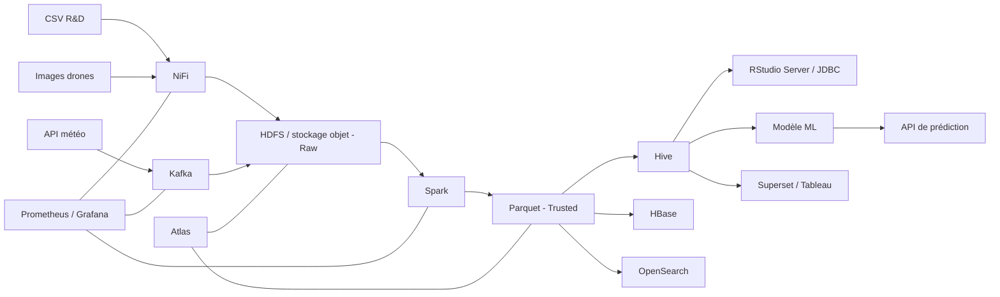

# Architecture cible et justification

## Décision

Le dépôt est un prototype local de l'architecture cible suivante :

| Besoin | Choix cible | Justification | Prototype local |
|---|---|---|---|
| Plateforme | Hadoop/HDFS ou stockage objet compatible S3 | Écosystème ouvert, Parquet et calcul distribué | Répertoires zonés |
| Ingestion fichiers | NiFi | Routage, provenance et reprise visuelle | Chaîne de processeurs Python |
| Ingestion relationnelle historique | Sqoop | Correspond au cas RDBMS vers Hadoop du sujet | Import CSV vers Parquet |
| Streaming | Kafka | Découplage, partitions et rétention | Producteur/consommateur Python |
| Traitement | Spark | Calcul distribué et ML | PySpark `local[*]` |
| SQL | Hive | Accès SQL et JDBC pour R/BI | DuckDB sur Parquet |
| NoSQL | HBase | Accès par clé aux essais et matériels | SQLite column-family |
| Recherche | OpenSearch | Recherche libre et filtres | SQLite FTS5 |
| Gouvernance | Atlas + Hive Metastore | Catalogue et lineage | Catalogue SQLite |
| Statistiques | Rscript / RStudio Server | Contrainte explicite du sujet | Phase Rscript automatisée |
| Visualisation | Superset ou Tableau | Exploration métier et contrôle d'accès | Dashboard HTML/Folium |
| Monitoring | Prometheus/Grafana | Métriques, alertes et historique | JSON/JSONL + API santé |

Cloudera est l'option de distribution administrée si un support éditeur est
requis. Hortonworks a fusionné avec Cloudera et MapR appartient à HPE; les
présenter comme distributions indépendantes nouvelles ne serait pas pertinent.

## Comparaison des options

### Plateforme

| Option | Coût/support | Avantages | Limites | Décision |
|---|---|---|---|---|
| Hadoop Apache | Logiciel ouvert, exploitation interne | Liberté, écosystème large | Administration complexe | Base technique du prototype |
| Cloudera | Licence et support éditeur | Administration, sécurité, distribution intégrée | Coût et dépendance éditeur | Cible si support contractuel requis |
| Hortonworks | Offre historique fusionnée avec Cloudera | Forte orientation open source historique | Plus une option indépendante actuelle | Non retenu |
| MapR/HPE Ezmeral | Offre commerciale HPE | Stockage et plateforme intégrés | Écosystème moins aligné avec le prototype | Non retenu |

### Ingestion et orchestration

| Outil | Cas adapté | Avantages | Limites | Décision |
|---|---|---|---|---|
| NiFi | Fichiers, API, routage et streaming léger | Provenance, reprise, interface visuelle | Pas un ETL analytique complet | Retenu pour l'ingestion |
| Sqoop | Import historique RDBMS vers Hadoop | Simple pour les chargements massifs SQL | Spécialisé et peu adapté aux API | Retenu pour le cas historique |
| Talend | ETL d'entreprise et nombreux connecteurs | Mapping visuel et gouvernance | Licence/empreinte plus importantes | Logique reproduite localement |
| Airflow/Oozie | Ordonnancement et dépendances | Planification, reprise et historique | Infrastructure supplémentaire | Cible production; checkpoint local |

### Stockage et recherche

| Outil | Forces | Limites | Décision |
|---|---|---|---|
| HBase | Accès par clé, colonnes larges, intégration Hadoop | Opérations et scans complexes | Retenu pour essais/résultats |
| Cassandra | Haute disponibilité multi-datacenter | Moins intégré à HDFS/Hive | Non retenu pour ce contexte |
| OpenSearch | Recherche plein texte et filtres | Index secondaire à maintenir | Cible recherche |
| SQLite FTS5 | Léger, reproductible localement | Non distribué | Moteur du prototype |

### Restitution

| Outil | Avantages | Limites | Décision |
|---|---|---|---|
| Tableau | Exploration métier riche | Licence et fichier propriétaire | Option entreprise |
| Spotfire | Analytics scientifique | Licence | Option si déjà présent dans le SI |
| Superset | Open source et SQL natif | Administration à déployer | Cible ouverte privilégiée |
| HTML/Folium | Portable et sans serveur BI | Moins de gouvernance BI | Livrable du prototype |

## Évolutivité

Les CSV, événements JSON météo et images drones suivent des flux indépendants.
Les tables sont partitionnées par date, espèce et source. Les images restent dans
le stockage objet; seules leurs métadonnées et caractéristiques calculées sont
indexées. Kafka absorbe les pics, Spark scale horizontalement et les couches
Raw/Trusted/Curated évitent de coupler ingestion et consommation.
