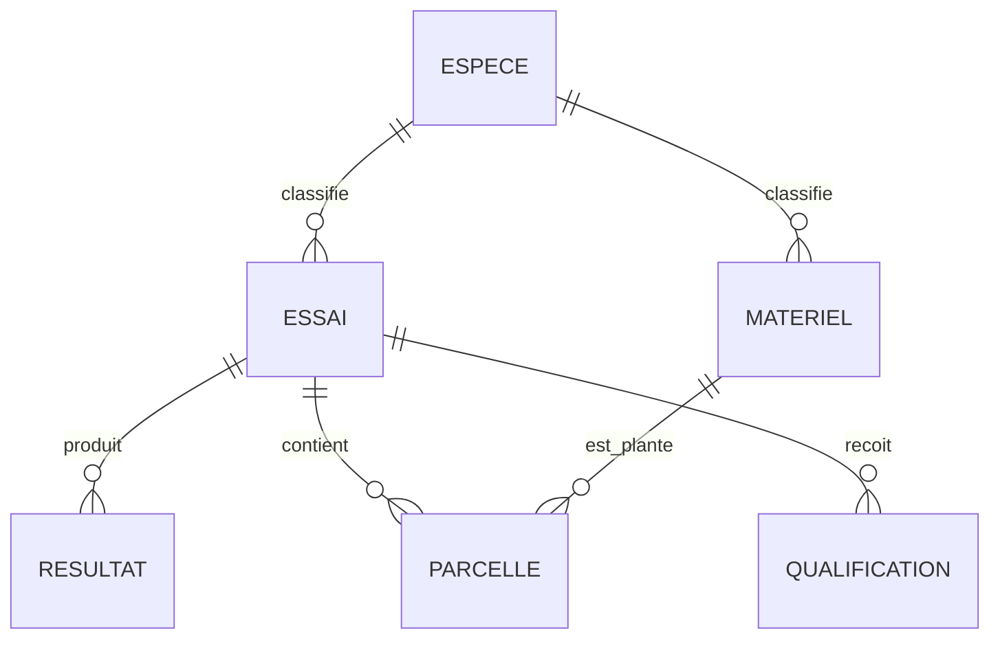

# Modèle et dictionnaire de données

| Entité | Clé | Rôle |
|---|---|---|
| ESSAI | `LK_EXPERIMENT_EXPERIMENT_ID` | Site, année, espèce, région et fiabilité |
| RESULTAT | `LK_SL_TRIAL_L2_DATA_ID` | Valeur d'un trait par entrée et réplication |
| PARCELLE | `LK_SL_TRIAL_L4_DATA_ID` | Lien essai, réplication, entrée et matériel |
| MATERIEL | `LK_STOCK_S1_DATA_ID` | Lignée, variété, pedigree et parents |
| QUALIFICATION | `SL_TRIAL`, `YEAR`, `QUALIFICATION` | Attributs qualité d'un essai |
| ESPECE | `SPECIES_ID`, `SPECIES_SPECIFICITY_ID` | Référentiel taxonomique |

## Colonnes métier principales

| Colonne | Définition | Règle |
|---|---|---|
| `YEAR` | Année culturale | Entier, 2015 à 2018 dans le lot actuel |
| `SPECIES` | Code espèce source | Référentiel contrôlé |
| `ESPECE_FR` | Libellé français enrichi | Dérivé du code espèce |
| `TRAIT` | Caractère mesuré | `%MOIS`, `YD15QH`, `YD16QH`, etc. |
| `RESULT_NUM` | Valeur numérique normalisée | Conversion du séparateur décimal |
| `REGION` | Région du site d'essai | Peut être absente faute de correspondance source |
| `LAT`, `LON` | Coordonnées WGS84 | Couples `(0,0)` invalides |
| `MAIN_NAME` | Nom du matériel génétique | Recherchable dans le catalogue |
| `PEDIGREE` | Ascendance du matériel | Texte génétique source |

Le dictionnaire technique complet (type, nullabilité, taux de nullité et
cardinalité) est généré dans `catalog/semences_catalog.db`.

## Contrats et limites

La table de faits conserve toutes les mesures. Les métadonnées ESSAI ne couvrent
pas tous les identifiants de RESULTAT; une jointure gauche préserve les mesures
et expose explicitement les valeurs géographiques manquantes.
